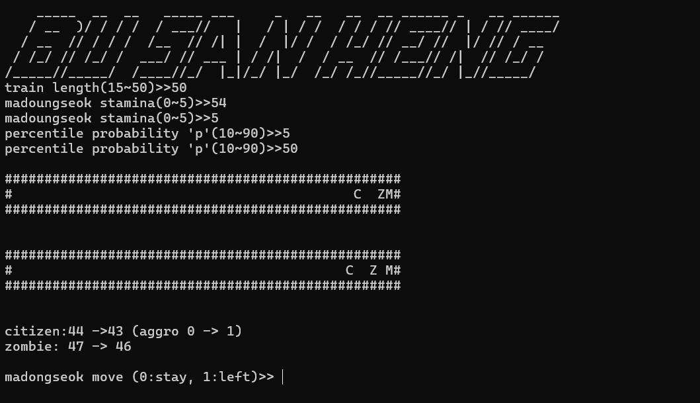
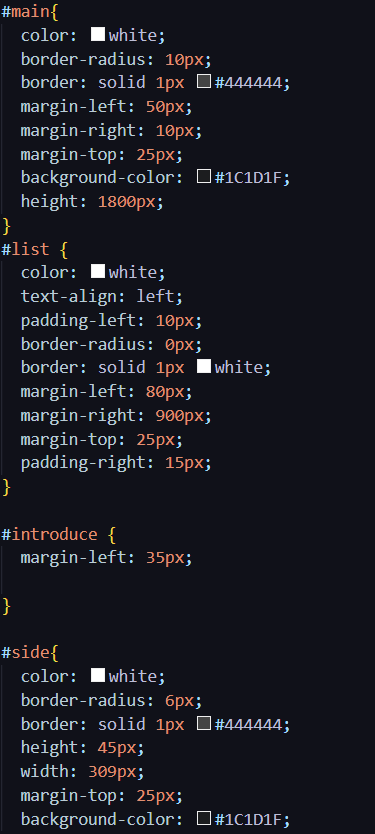
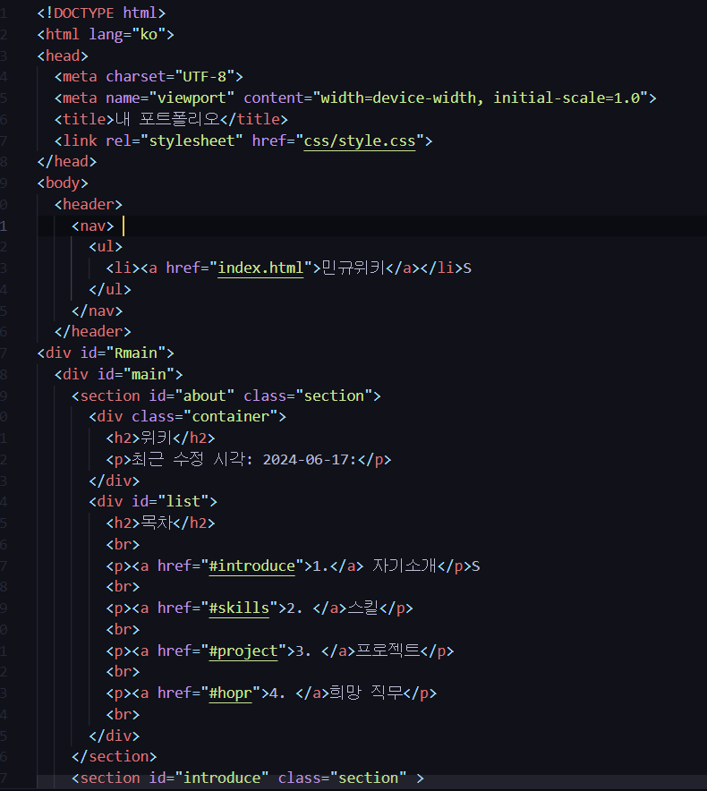
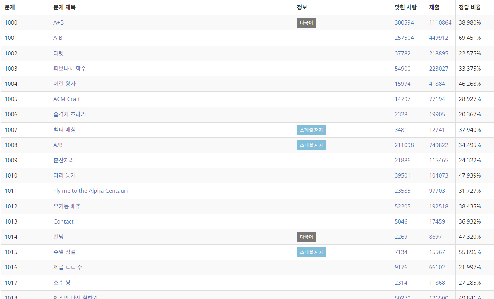

# mingyu.github.io
<a href="https://github.com/mingyu00000/mingyu.github.io" target="_blank">github 링크</a>

<a href="[http://127.0.0.1:5500/%EA%B3%BC%EC%A0%9C/index.html](https://mingyu00000.github.io/)" target="blank">홈페이지 링크<a/>
# 내 포트폴리오

## 민규위키

### 최근 수정 시각: 2024-06-21

### 분류: [박민규](#introduce)

## 목차
1. [자기소개](#introduce)
2. [스킬](#skills)
3. [프로젝트](#project)
4. [희망 직무](#hope)

## 1. 자기소개
어디 학교에 재학중이 이 홈페이지에서 어떤걸 알려주는지 간단하게 설명합니다.

## 2. 스킬
제가 사용가능한 프로그래밍 언어를 소개하고 현재 어느정도로 사용이 가능하며 어떤 장점이 있는지 얘기합니다.

## 3. 프로젝트
제가 지금까지 만들거나 예정인 프로젝트를 다룹니다. 부산헹과 웹페이지 만든건 완성한 프로젝트이며, 게임 만들기와 독한 홈페이지, 보안 프로그램은 예정입니다.

### 프로젝트 1 - 부산행
이 부산헹은 1턴 2턴 같은 턴으로 하는 게임이며 시민은 좀비로 부터 지키며 탈출 시키는 간단한 게임입니다.

### 프로젝트 2 - 웹페이지 만들기
저를 소개하는 포르폴리오간은 웹페이지 입니다. 저의 스킬과 지금까지 한 프로젝트 또는 예정인 프로젝트 그리고, 희망 직무를 다룹니다.

### 프로젝트 3 - 독학 홈페이지 만들기 (예정)
독학 홈페이지라는 코딩 기초부터 독할할 수 있는 홈페이지를 만들고 싶습니다.

### 프로젝트 4 - 게임 만들기 (예정)
나중에 게임을 만들고 싶어서 어떤 게임을 만들고 싶은지 얘기합니다.

### 프로젝트 5 - 보안 프로그램 제작 (예정)
보안 프로그램이라는 개인 정보나 회사 기밀같은 정보를 유출되지 않게 보호 해주는 프로그램을 만들고 싶습니다.

## 4. 희망 직무
제가 미래에 어떤 직업을 하고싶고 어떤 계획이 있는 얘기합니다.

## 수정 내역
- 홈페이지 만들기 시작: 6/16
- 컨셉 정하고 목차, 자기소개, 스킬 추가: 6/17
- 프로젝트, 희망 직무, 꾸미기 추가: 6/21

## 따라다니는 광고

